# Stock Research Chatbot - Technical Deep Dive

**Version**: 3.0.0  
**Last Updated**: Nov 10, 2025

This document provides a system design-level deep dive into the technical implementation of the Stock Research Chatbot. It is intended for managers and senior engineers who require a detailed understanding of the code, with real snippets and line-by-line explanations of how components are linked.

---

## 1. System Design: The Request Flow

From a system design perspective, the application is architected to handle a user query by breaking it down into a series of asynchronous tasks, processing them in parallel, and streaming the results back to the user in real-time. The system is designed to be scalable, resilient, and maintainable.

### High-Level Data Flow

```mermaid
sequenceDiagram
    participant User
    participant Frontend (React)
    participant Backend (FastAPI)
    participant LogBroadcaster
    participant Orchestrator
    participant GeminiAPI
    participant YahooFinanceAPI

    User->>Frontend: Enters query "Analyze AAPL"
    Frontend->>Backend: POST /api/v1/analyze (query: "Analyze AAPL")
    Backend->>Frontend: Returns { request_id: "uuid-123" }
    Frontend->>Backend: WebSocket /ws/uuid-123
    Backend->>LogBroadcaster: Create broadcaster for uuid-123
    LogBroadcaster->>Frontend: Emits "📝 Analyzing your query..."
    Backend->>Orchestrator: analyze(query, request_id)
    Orchestrator->>YahooFinanceAPI: Fetch data for AAPL
    Orchestrator->>GeminiAPI: Summarize news, analyze data
    Orchestrator->>LogBroadcaster: Emits progress updates (e.g., "📰 Searching for news...")
    LogBroadcaster->>Frontend: Streams logs via WebSocket
    Orchestrator-->>Backend: Returns final analysis
    Backend-->>Frontend: Returns final JSON response via initial HTTP request
```



---

## 2. Deep Dive: The Code Linkages

This section traces the lifecycle of a request, showing the exact code and file linkages from frontend to backend.

### Step 1: Frontend Initiates Analysis (HTTP Request)

The process starts when the user submits a query in the React frontend.

-   **File**: `frontend/stock-research-ui/src/App.jsx`

An API call is made to the backend `/analyze` endpoint. The `request_id` is generated on the backend and returned in the initial response, which is then used to establish the WebSocket connection.

### Step 2: Backend Receives Request and Creates a Log Stream

The FastAPI backend receives the POST request.

-   **File**: `backend/app/api.py`

```python
# backend/app/api.py: line 40
@router.post("/analyze", response_model=AnalysisResponse)
async def analyze_stocks(request: AnalysisRequest) -> AnalysisResponse:
    # ...
    request_id = request.request_id or str(uuid.uuid4())
    # ...
    connection_manager = get_connection_manager()
    log_broadcaster = create_log_broadcaster(request_id, connection_manager)
    
    # This is the first user-facing log message
    await log_broadcaster.query_received(request.query)
    # ...
```

**Code Linkage:**

1.  **`api.py:61`**: `create_log_broadcaster(request_id, connection_manager)` is called.
    -   **File**: `backend/services/log_broadcaster.py`
    -   **Link**: This function (line 175) returns a new `LogBroadcaster` instance, which is now tied to the unique `request_id`.

2.  **`api.py:64`**: `log_broadcaster.query_received(request.query)` is called.
    -   **File**: `backend/services/log_broadcaster.py`
    -   **Link**: This method (line 99) constructs a professional, user-facing log message and calls `self.emit()`.

### Step 3: Frontend Connects to WebSocket

Upon receiving the `request_id`, the frontend establishes a WebSocket connection.

-   **File**: `frontend/stock-research-ui/src/hooks/useWebSocketLogs.js`

```javascript
// frontend/stock-research-ui/src/hooks/useWebSocketLogs.js: line 32
const wsUrl = `ws://localhost:8000/ws/${requestId}`
const ws = new WebSocket(wsUrl)

ws.onmessage = (event) => {
  const logEvent = JSON.parse(event.data)
  setLogs((prevLogs) => [...prevLogs, logEvent])
}
```

**Code Linkage:**

1.  The frontend connects to the WebSocket endpoint defined in the backend.
    -   **File**: `backend/app/main.py`
    -   **Link**: The `@app.websocket("/ws/{request_id}")` decorator (line 77) handles this connection. The `ConnectionManager` (from `websocket.py`) is used to store and manage this connection, associating it with the `request_id`.

### Step 4: Orchestrator Executes the Analysis

The `api.py` route now hands off the main analysis task to the `YahooFinanceOrchestrator`.

-   **File**: `backend/app/api.py`

```python
# backend/app/api.py: line 245
results = await orchestrator.analyze(
    query=request.query,
    # ...
    log_broadcaster=log_broadcaster
)
```

**Code Linkage:**

1.  The `orchestrator.analyze()` method is called.
    -   **File**: `backend/agents/yahoo_finance_orchestrator.py`
    -   **Link**: This is the main entry point for the multi-agent analysis (line 300). The `log_broadcaster` instance is passed through, allowing the orchestrator to send real-time updates directly to the user.

### Step 5: Agents Fetch and Analyze Data

Inside the orchestrator, agents are run in parallel for each ticker.

-   **File**: `backend/agents/yahoo_finance_orchestrator.py`

```python
# backend/agents/yahoo_finance_orchestrator.py: line 356
tasks = [self._analyze_ticker(ticker, query, max_iterations) for ticker in tickers]
insights = await asyncio.gather(*tasks, return_exceptions=True)
```

The `_analyze_ticker` method is where the real work happens. It calls various tools and services, sending log updates at each step.

**Code Linkage Example: Fetching News**

```python
# backend/agents/yahoo_finance_orchestrator.py: line 102
if self.log_broadcaster:
    await self.log_broadcaster.fetching_news(ticker, company_name)

news_articles = self.yahoo_tool.get_news(ticker, limit=10)
```

1.  **`log_broadcaster.fetching_news()`**: A user-facing log is sent to the frontend.
2.  **`yahoo_tool.get_news()`**: This method is called to fetch data.
    -   **File**: `backend/tools/yahoo_finance_tool.py`
    -   **Link**: The `get_news` method (line 153) makes an API call to the Manus API Hub (`YahooFinance/get_news_by_symbol`) to get the latest articles.

### Step 6: AI Synthesizes the Final Report

After all data is gathered, the `Synthesis Agent` (within the orchestrator) uses the Gemini API to generate the final investment analysis.

-   **File**: `backend/agents/yahoo_finance_orchestrator.py`

```python
# backend/agents/yahoo_finance_orchestrator.py: line 209
investment_analysis = self.gemini_service.generate_investment_analysis(
    ticker=ticker,
    # ... all gathered data
)
```

**Code Linkage:**

1.  **`gemini_service.generate_investment_analysis()`** is called.
    -   **File**: `backend/services/gemini_service.py`
    -   **Link**: This method (line 106) constructs a highly detailed, structured prompt with all the gathered data (news, price, financials). It then sends this prompt to the Gemini API (`gemini-2.5-flash` model) and parses the JSON response to get the final analysis.

### Step 7: Final Response and Stream Closure

Once the orchestrator returns the final `insights`, the `api.py` route formats the response and sends it back to the frontend via the original HTTP request. The WebSocket stream is kept open for a short period and then closed.

---

## 3. Deep Dive: The WebSocket and Logging System

This is the core of the real-time user experience. It's designed to be robust and decoupled from the main application logic.

### Components

1.  **`ConnectionManager` (`websocket.py`)**: A singleton class that acts as a central registry for all active WebSocket connections. It uses a dictionary to map a `request_id` to a set of WebSocket connections, allowing multiple browser tabs to watch the same analysis.

2.  **`LogBroadcaster` (`log_broadcaster.py`)**: A class that is instantiated for each analysis request. It provides a high-level, user-friendly API for sending log messages (e.g., `fetching_news()`, `analyzing_technicals()`). It uses the `ConnectionManager` to broadcast these messages to the correct clients.

### How it Works: Line-by-Line

1.  **A log is triggered in the orchestrator:**

    ```python
    # backend/agents/yahoo_finance_orchestrator.py: line 152
    if self.log_broadcaster:
        await self.log_broadcaster.fetching_price_data(ticker, company_name)
    ```

2.  **The `LogBroadcaster` formats the message:**

    ```python
    # backend/services/log_broadcaster.py: line 180
    async def fetching_price_data(self, ticker: str, company_name: str = None):
        display_name = company_name or ticker
        await self.emit(
            LogEventType.AGENT_START,
            f"📈 Analyzing price trends and technical indicators for {display_name}...",
            agent="price",
            details={"ticker": ticker},
            delay=0.7
        )
    ```

3.  **The `emit` method sends it to the `ConnectionManager`:**

    ```python
    # backend/services/log_broadcaster.py: line 76
    await self.connection_manager.broadcast(self.request_id, log_event)
    ```

4.  **The `ConnectionManager` sends it to the client's WebSocket:**

    ```python
    # backend/app/websocket.py: line 52
    async def broadcast(self, request_id: str, message: Dict[str, Any]):
        # ...
        connections = list(self.active_connections[request_id])
        for connection in connections:
            await connection.send_text(message_json)
    ```

This decoupled design is excellent because the analysis code (orchestrator) doesn't need to know anything about WebSockets. It just calls a simple logging method, and the `LogBroadcaster` and `ConnectionManager` handle the real-time communication complexities.

This concludes the technical deep dive. This level of detail, with direct code linkages and explanations of design choices, should provide your manager with the in-depth understanding they require.
