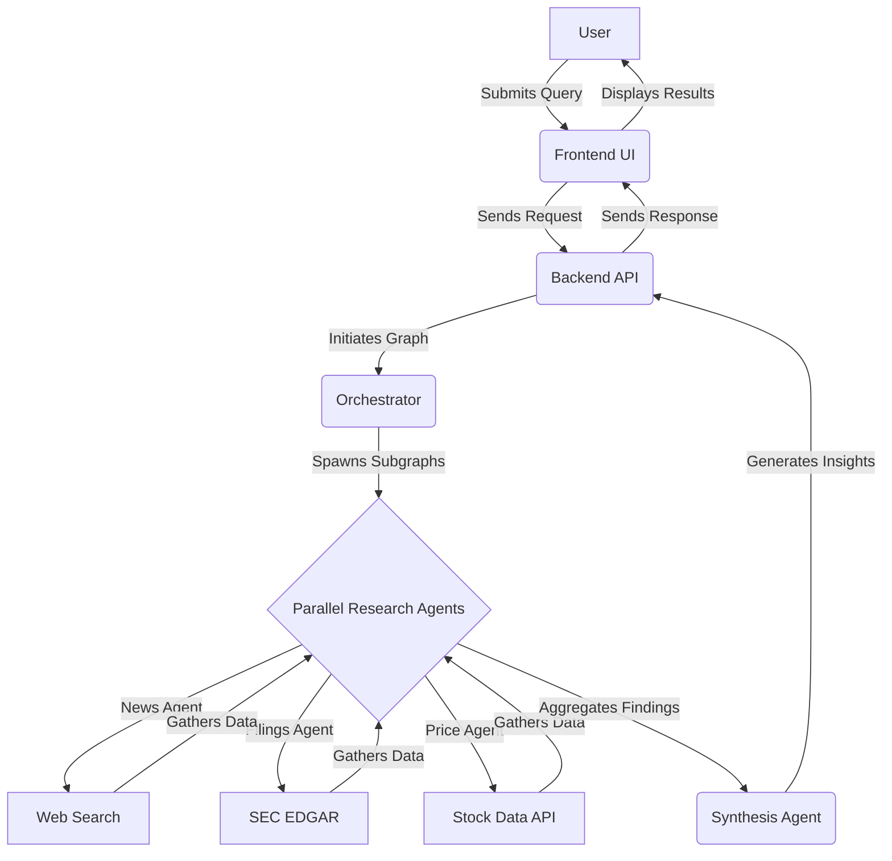

# Stock Research Agentic Chatbot: System Architecture

This document outlines the system architecture for the Stock Research Agentic Chatbot, as per the requirements specified in the project description.

## 1. High-Level Overview

The system is designed as a multi-agent chatbot that conducts research on multiple stock tickers simultaneously. It leverages a large language model (LLM) for natural language understanding and generation, and a structured agent framework to perform and orchestrate research tasks. The final output is a well-documented, containerized application with a simple user interface.

## 2. Core Components

The architecture is composed of the following key components:

| Component | Technology | Description |
| :--- | :--- | :--- |
| **Frontend UI** | React & Streamlit | A choice of two web-based user interfaces for user interaction, displaying the research process and final results. |
| **Backend API** | FastAPI | An HTTP server that exposes an endpoint to receive user requests and trigger the research workflow. |
| **Orchestrator** | LangGraph | The central component that manages the overall workflow, parsing user input and spawning parallel research agents for each stock ticker. |
| **Research Agents** | LangGraph (ReAct) | Specialized agents responsible for gathering specific types of information (e.g., news, financial filings, patents). Each agent operates in a Reason-Act (ReAct) loop. |
| **LLM** | Gemini 2.5 Flash | The underlying language model used for understanding, reasoning, and generating insights. |
| **Tooling** | Custom Python | A collection of tools for the agents to interact with the external world, such as web search, financial data APIs, and SEC EDGAR access. |
| **Vector Database** | Chroma | A vector database to store and retrieve embeddings of the gathered information, facilitating the synthesis of insights. |
| **Containerization** | Docker | The entire application is packaged into a Docker container for easy, one-command deployment. |

## 3. System Flow Diagram

## 4. Data Flow

1. The user submits a natural language query with stock tickers to the frontend UI (e.g., "Analyze NVDA, AMD, TSM for AI datacenter demand").
2. The frontend sends the request to the FastAPI backend.
3. The backend's LangGraph orchestrator parses the request and initiates a main graph.
4. For each ticker, the orchestrator spawns a parallel subgraph of specialized research agents (News, Filings, etc.).
5. Each research agent executes a ReAct loop: it thinks about the task, acts by calling a tool (e.g., web search), and observes the result.
6. The data gathered by the tools (articles, financial data) is processed, and key information is used for analysis.
7. After the research agents complete their tasks (or hit a stop condition like `MAX_ITERS`), a synthesis module aggregates the findings.
8. The synthesis module generates a cited summary, a short-term stance (hold/short/sell), and a confidence score for each ticker.
9. The final results are sent back to the frontend UI and displayed to the user.

## 5. Security Considerations

- The Gemini API key and any other sensitive credentials will be managed via a `.env` file and will not be hardcoded in the application.
- All web scraping activities will respect `robots.txt` and the terms of service of the target websites.
- The application will not require or store any personal user data.

